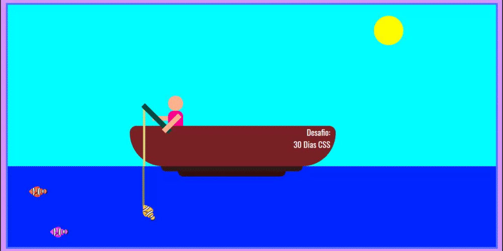

# :rocket: Desafio 30 dias de CSS :rocket:

## 1º Dia (05/01/2021) :white_check_mark:

- Menu com efeitos [transition](https://www.w3schools.com/css/css3_transitions.asp) no [hover](https://www.w3schools.com/cssref/sel_hover.asp). Layout: /* Gray-scale */

:link: [Meu codigo](https://github.com/chrislemos/Desafio30DiasCSS/tree/master/Desafios/dia1)

## 2º Dia (06/01/2021) :white_check_mark:

- Cenário de pesca onde o pescador consegue um peixe haha
- Utilizei nesse exercício:
- - animation;
- - transform;
- - CSS Grid. 

:link: [Meu codigo](https://github.com/chrislemos/Desafio30DiasCSS/tree/master/Desafios/dia2)

## 3º Dia (07/01/2021) :white_check_mark:

- Álbum de fotografias no formato polaroid.
- Utilizei nesse exercício:
- - box-shadow;
- - CSS Grid;
- - Opacity;
- - Transition.

:link: [Meu codigo](https://github.com/chrislemos/Desafio30DiasCSS/tree/master/Desafios/dia3)

## 4º Dia (08/01/2021) :clock1: